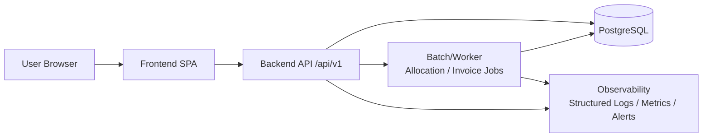
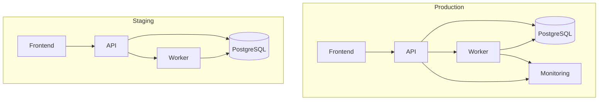

# Architecture Diagram (Logical, MVP v2)

Date: 2026-03-17

## 1) Logical Component Diagram

## 2) Runtime / Environment Diagram

## 3) Key Operational Notes
- Status transitions are explicit user-triggered bulk actions.
- Line status is updated first; no automatic order status promotion in MVP.
- Server-side authoritative amount/tax calculation.
- Catch-weight validation is enforced at invoice finalize.
- Audit logs required for critical actions (cancel/override/reset/unlock).
