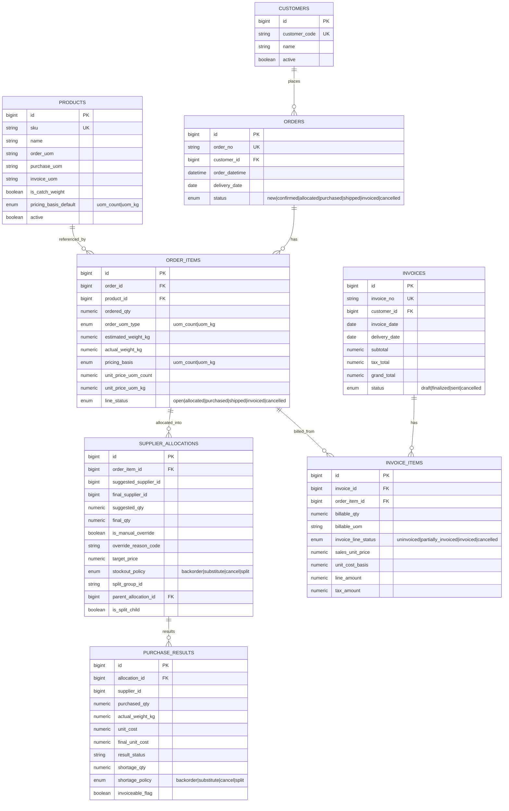

# ERD (MVP v2, Dual-UOM)

Date: 2026-03-17

## Constraints (summary)
- `orders.order_no`, `products.sku`, `customers.customer_code`, `invoices.invoice_no`: UNIQUE
- `order_items.ordered_qty > 0`
- price-by-basis check:
  - `pricing_basis=uom_count` => `unit_price_uom_count` required
  - `pricing_basis=uom_kg` => `unit_price_uom_kg` required
- catch-weight line requires `actual_weight_kg` at invoice finalize.
