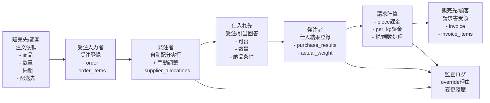

# Order System フローチャート（役割とインプット）

この図は、受注〜仕入〜請求までの共通認識を作るためのベースです。

## 全体フロー（Mermaid）

---

## 役割ごとの責務・主インプット

### 1) 受注入力者
- 主責務
  - 顧客注文を正確に登録
  - 明細単位で単位（UOM）と価格基準を設定
- 主インプット
  - 顧客情報（販売先）
  - 注文番号、商品、数量、希望納期、配送区分
  - 価格基準（per_order_uom / per_kg）
  - （必要なら）見込み重量
- 主アウトプット
  - `orders`
  - `order_items`

### 2) 発注者
- 主責務
  - 受注明細を仕入れ先へ割当
  - 自動配分結果の確認・修正（override/split line）
  - 割当確定
- 主インプット
  - 受注明細
  - 仕入れ先候補・供給能力
  - 運用ルール（欠品、価格、緊急、顧客要望など）
- 主アウトプット
  - `supplier_allocations`
  - override理由（`override_reason_code`）
  - split group 情報（分割時）

### 3) 仕入れ先
- 主責務
  - 発注内容に対する可否回答
  - 実際の納品数量・条件提示
- 主インプット
  - 発注内容（商品、数量、UOM、納期）
- 主アウトプット
  - 引当結果（full / partial / failed / substitute）
  - 実重量情報（catch-weight対象）

### 4) 販売先（顧客）
- 主責務
  - 注文情報の提示
  - 請求確認・支払い
- 主インプット
  - 見積・条件・納品結果
- 主アウトプット
  - 注文依頼
  - 支払いステータス

---

## システム上の重要ポイント（共通認識）

- 単位の違いを吸収する
  - 受注単位（piece/box）と仕入・請求単位（kg等）を分離管理
- Catch-weightの請求確定条件
  - `actual_weight_kg` がないと請求確定不可
- 手動調整の監査
  - override/splitは「誰が・いつ・なぜ」を必ず記録
- Split line整合性
  - 子配分合計数量 = 親配分数量
  - UOM不一致は確定時にブロック

---

## 運用会議でこの図を使うときの確認質問

- 受注時点で必須入力に不足はないか？
- 自動配分のデフォルトルールは妥当か？
- split line の判断基準は現場で一致しているか？
- 実重量の記録タイミングはどこで固定するか？
- 請求確定の責任者とチェック観点は明確か？
